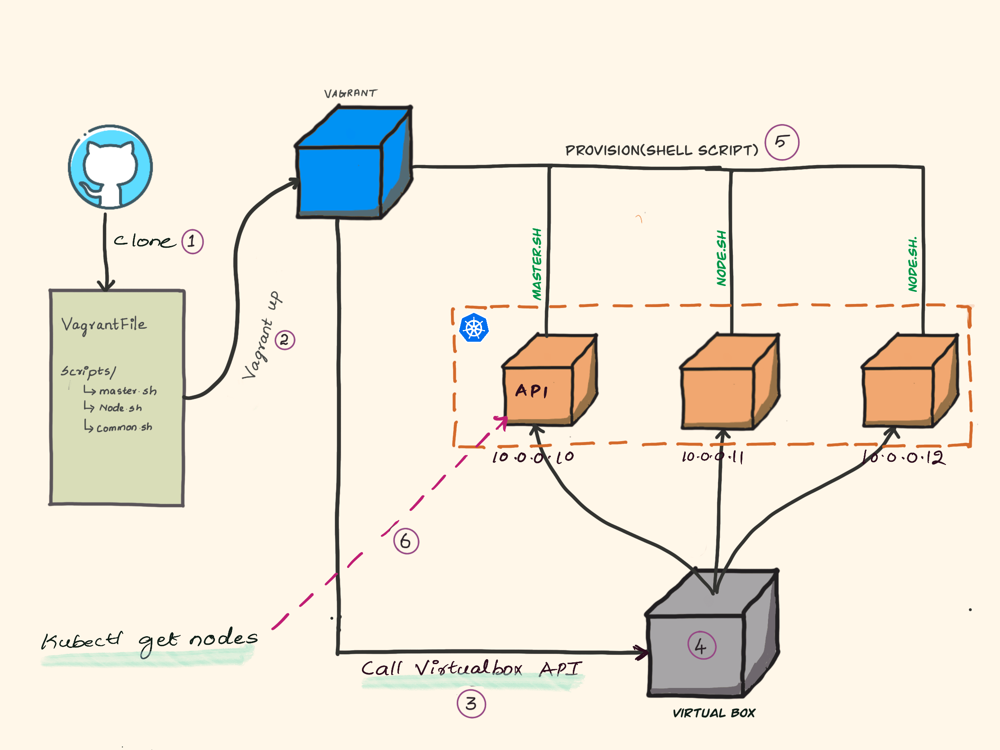

# Vagrantfile and Scripts to Automate Kubernetes Setup using Kubeadm [Practice Environment for CKA/CKAD and CKS Exams]



## Documentation

If Vagrant is not installed, use this documentation: https://developer.hashicorp.com/vagrant/downloads

## Prerequisites

1. Working Vagrant setup
2. 8 Gig + RAM workstation as the Vms use 3 vCPUS and 4+ GB RAM

## For MAC/Linux Users

Latest version of Virtualbox for Mac/Linux can cause issues because you have to create/edit the /etc/vbox/networks.conf file and add:
<pre>* 0.0.0.0/0 ::/0</pre>

or run below commands

```shell
sudo mkdir -p /etc/vbox/
echo "* 0.0.0.0/0 ::/0" | sudo tee -a /etc/vbox/networks.conf
```

So that the host only networks can be in any range, not just 192.168.56.0/21 as described here:
https://discuss.hashicorp.com/t/vagrant-2-2-18-osx-11-6-cannot-create-private-network/30984/23

## Usage/Examples

To provision the cluster, execute the following commands.

```shell
git clone https://github.com/vinycloud/vagrant-k8s.git
cd vagrant-k8s
vagrant up
```

## Set Kubeconfig file variable

```shell
cd vagrant-k8s/configs
export KUBECONFIG=$(pwd)/config
```

or you can copy the config file to .kube directory.

```shell
cp configs/config ~/.kube/
```

## Check the status of cluster after config kubeconfig

```shell
kubectl get nodes
```

## Before open Kubernetes Dashboard, execute the following command below:

```shell
kubectl proxy
```

## Kubernetes Dashboard URL

```shell
http://localhost:8001/api/v1/namespaces/kubernetes-dashboard/services/https:kubernetes-dashboard:/proxy/#/overview?namespace=kubernetes-dashboard
```

## Kubernetes login token

Vagrant up will create the admin user token and saves in the configs directory.

```shell
cd vagrant-k8s/configs
cat token
```

## To shutdown the cluster,

```shell
vagrant halt
```

## To restart the cluster,

```shell
vagrant up
```

## To destroy the cluster,

```shell
vagrant destroy -f
```

## I hope it helped you to learn and study for you exam! :)

